# This is a java project, with just simple print out commands
## The perpose was demonstrate how to perform git operations on a project

## Git initialized
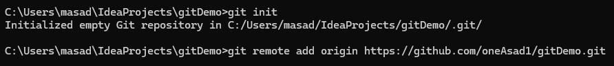

## all files added to track
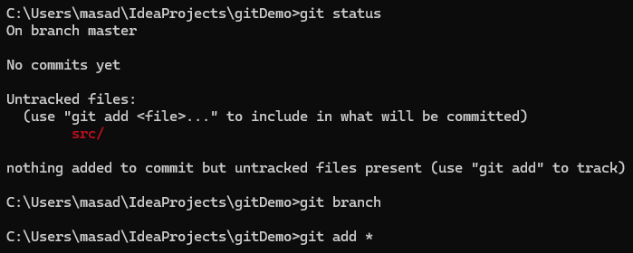

## First commit

## First push

## New branch
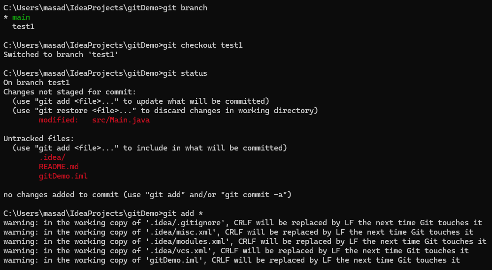

## Changes from new branch
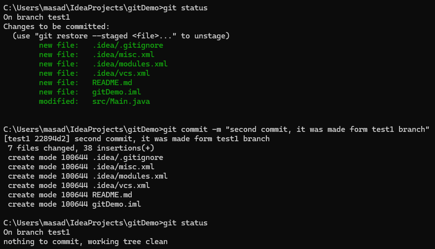

## Watching differnce of main and new branch
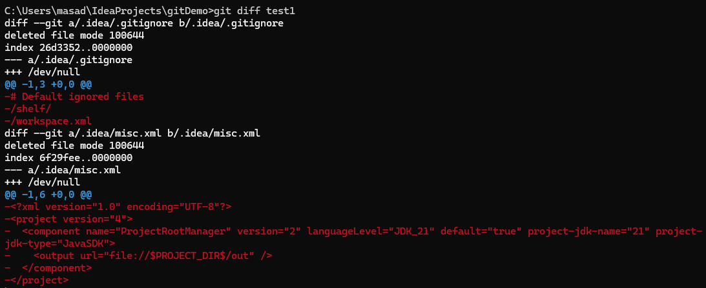

## New branch merged into main branch
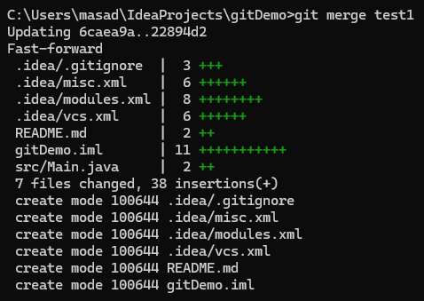

## After Merge results
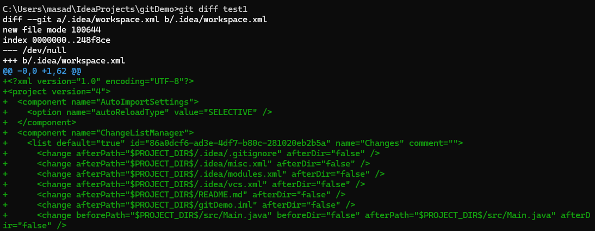

## Deleted that new branch
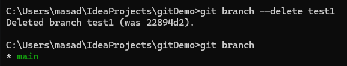

## Again modifying in main branch
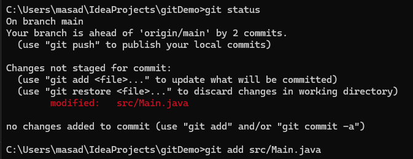

## Before restore added a new line
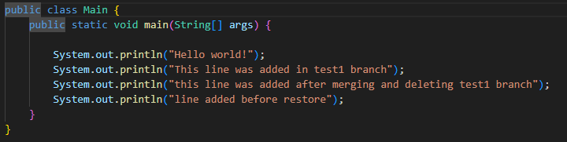

## After restore that line was now removed
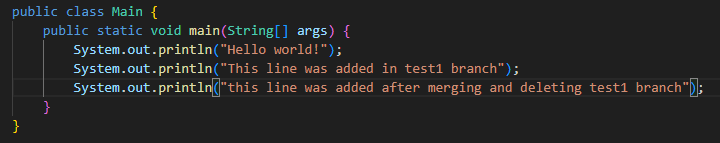
